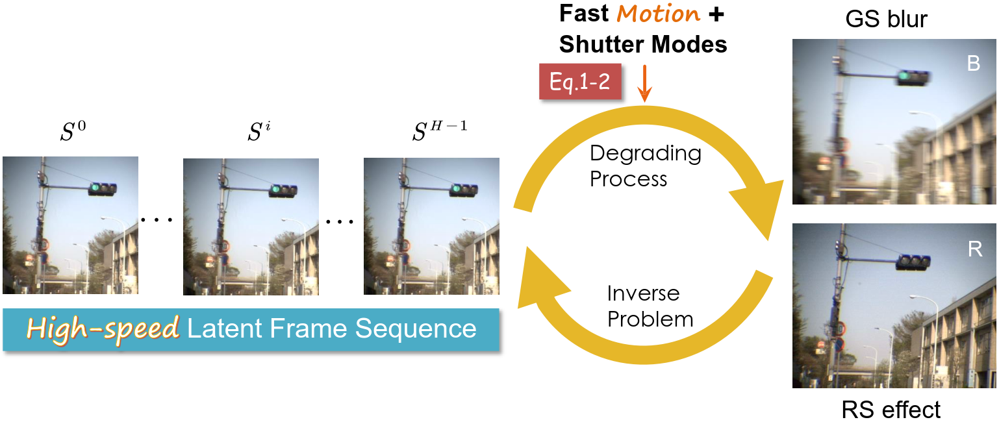

## Moment Reenacting: Inverse Motion Degradation with Cross-shutter Guidance

Xiang Ji, Guixu Lin, Zhengwei Yin, Jiancheng Zhao, and Yinqiang Zheng

The University of Tokyo


This repository provides the official PyTorch implementation of the paper.

#### TL;DR
This work proposes a unified framework to jointly address global shutter (GS) blur and rolling shutter (RS) distortion for reconstructing high-quality video frames under motion degradation. By introducing a novel dual-shutter setup that captures synchronized Blur-RS image pairs, the method leverages their complementary characteristics to resolve temporal and spatial ambiguities. To this end, we construct a triaxial imaging system to collect real-world aligned GS-RS pairs and high-speed ground truth frames. A dual-stream motion interpretation module and self-prompted reconstruction stage enable superior and generalizable video reconstruction under challenging motion scenarios.

<br/>
<!--

!-->
 
## Dependencies
1. Python and Pytorch
- Pyhotn=3.8 (Anaconda recommended)
- Pytorch=1.11.0
- CUDA=11.3/11.4
``` shell
conda create -n dualbr python=3.8
conda activate dualbr
conda install pytorch==1.11.0 torchvision==0.12.0 torchaudio==0.11.0 cudatoolkit=11.3 -c pytorch
```
2. Other packages
``` shell
pip install -r requirements.txt
```

## Data and Pretrained Model
- Download datasets [realBR](https://drive.google.com/file/d/1s9t6DHHfzB-o6pDhg4vqcgcFR6gdLxqj/view?usp=sharing) and synthetic data [GOPRO-VFI_copy](https://drive.google.com/file/d/1AaI1DD0SYECfL8GXFuCR6a4tZieRCMMe/view?usp=sharing) based on [GOPRO](https://drive.google.com/file/d/1rJTmM9_mLCNzBUUhYIGldBYgup279E_f/view?usp=sharing).  <!--   coming soon   -->
- Download the synthetic [stereoBR]() 
- Unzip them under a specified directory by yourself.
- Please download checkpoints from this [link](https://drive.google.com/drive/folders/1VDj-TLQxNCm3eIgCt5C-dJbYPDNzVLDO?usp=sharing) and put them under root directory of this project.

## Test
To test model, please run the command below:
``` shell
bash ./test.sh       ### Please specify your data directory, output path in the script
```
## Train
To train model, please run the command below:
``` shell
bash ./train.sh       ### Please refer to the script for more info.
```

## Acknowledgement
This project is implemented by partially referring to the code of work below:
- [RIFE](https://github.com/megvii-research/ECCV2022-RIFE)
